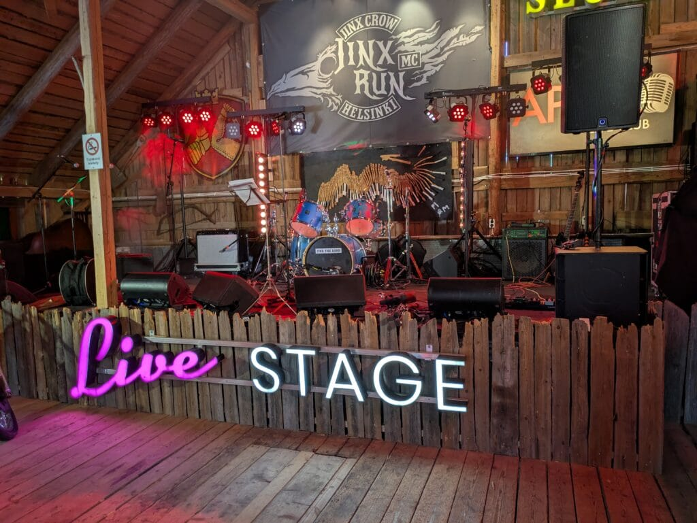
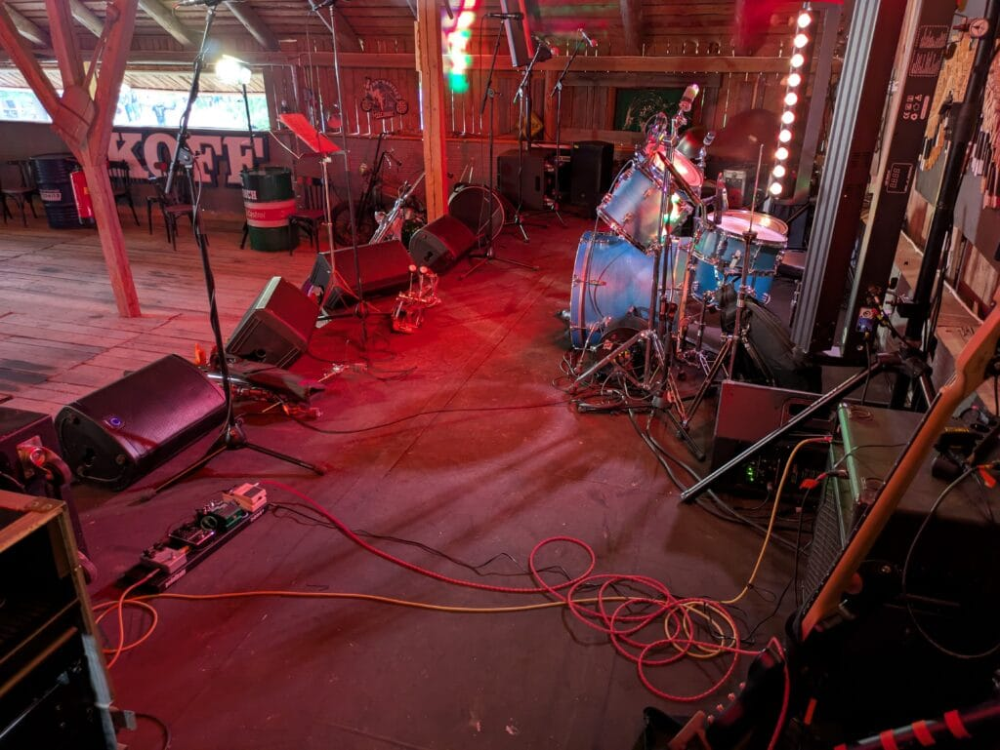
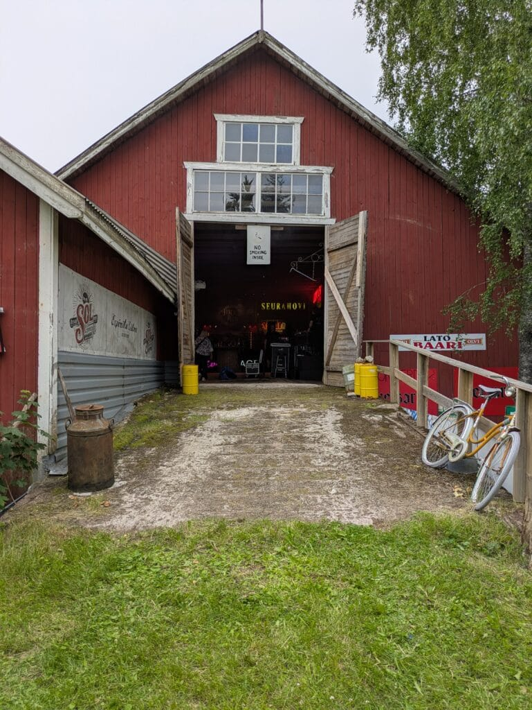

Oltiin **Let's Rumble** -kaveribändillä keikalla herttoniemeläisen prätkäkerhon maatilalla Liljendahlissa. Oikea kunnon kahden setin keikka. Saimme tämän kesän isomman keikan, kun käytiin viime marraskuussa ensin heidän klubillaan Helsingin Herttoniemen Erätorilla minikeikalla. Tykästyivät ja bookkasivat meidät kesälle Jinx Run -bileisiin.

**Jinx Crow MC** \-prätkäkerholla on upea **Jinx the Ranch** -maatila Liljendahlissa. Soittotila on isossa entisessä heinäkuivaamossa tms., josta on kunnostettu hieno soittopaikka ja sali baareineen. Laajat piha-alueet ja lisärakennuksia eri tarkoituksiin. Todellakin hieno biletyspaikka, joka on ymmärtääkseni myös vuokrattavissa. Paikka löytyy naamakirjasta nimellä Jinx The Ranch ja itse kerho nimellä Jinx Crow MC.

<figure>

<figure>

<figcaption>

Jinx the Ranch - stage

</figcaption>

</figure>

<figure>

<figcaption>

Jinx the Ranch - stage

</figcaption>

</figure>

<figure>

<figcaption>

Jinx the Ranch - juhlatila

</figcaption>

</figure>

</figure>

Aloitimme Let's Rumble -bändin kanssa keväällä treenata keikkaa varten. Nuo setteihin valitut biisit olivat muille soittajille tuttuja, mutta minä sain opetella parikymmentä itselleni "uutta" biisiä, joita en aiemmin ollut bändissä soittanutkaan kuin korkeintaan joskus epämääräisinä jamitusiltojen rykäisyinä. Nyt opettelin ne kunnolla, kivaa kun sai taas uusia biisejä omaan plakkariin.

## Biisilista

### 1\. setti

- Jailbreak - Thin Lizzy

- Crazy Miss Daisy - Frank Marino

- Foxey Lady - Jimi Hendrix

- Demon's Eye - Deep Purple

- Waitin' for the Bus - ZZ Top

- Got a Broken Heart - Walter Trout

- High - Royals

- Rosalie - Thin Lizzy

- Sometimes I Feel Like Screaming - Deep Purple

### 2\. setti

- Hocus Pocus - Focus

- Ready an' Willing - Whitesnake

- Rockin' in the Free World - Neil Young

- Little Wing - Jimi Hendrix

- Good Times Bad Times - Led Zeppelin

- I'd Love to Change the World - Ten Years After

- All Along the Watchtower - Jimi Hendrix

- Don't Believe a Word - Thin Lizzy

- 2-4-6-8 Motorway - The Tom Robinson Band

- D.O.A. - Van Halen

- It Ain't What You Do - Hurriganes

Soitot sujuivat pääosin kommelluksitta ja olihan yleisöäkin muutama kymmen, nämähän olivat pre-partyt, pääbileet ovat tilalla lauantaina. Toivotaan, että tämä keikka poikii lisää keikkoja. Niin ja tiedoksi, että meidät saa tietty bookata bileisiin soittamaan, minuun saa olla yhteydessä.

## Äänityksiä keikalta

Äänitin keikan omalla pikkuruisella Tascamillani miksauspöydän luota. Tämä on luottopeli vuodesta toiseen.

<figure>

<figcaption>

"Foxey Lady" esittäjältä Let's Rumble. 26.6.2026 keikalta Jinx The Ranch -maatilalta.

</figcaption>

</figure>

<figure>

<figcaption>

"Little Wing" esittäjältä Let's Rumble. 26.6.2026 keikalta Jinx The Ranch

</figcaption>

</figure>

Lisätäänpä loppuun vielä soittajat

- Laulu - Jari "Poce" Kokko

- Kitara - Jarmo "Jamo" Huttunen

- Rummut - Jari "Naru" Nyström

- Basso - Teuvo "Stedi" Väisänen

###### Fediversumi -reaktiot
