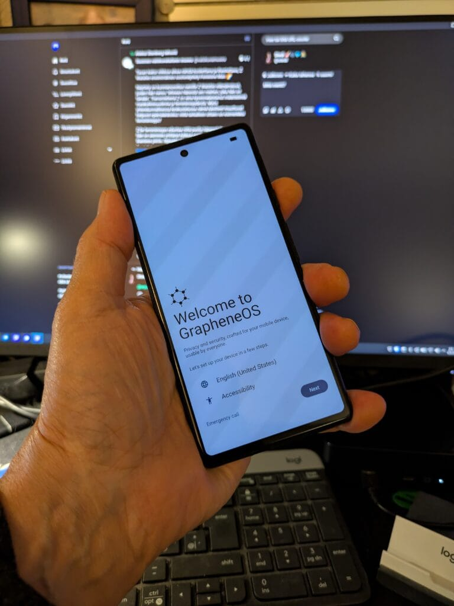

Sain takaisin lainassa olleen Pixel 6a -puhelimeni. Tämä mahdollistaa helpommin kokeilut GrapheneOS-käyttöjärjestelmän kanssa.

Googlen Pixel-puhelimiin on pitkään ollut tarjolla vaihtoehtoisia käyttöjärjestelmiä. Minua on kiinnostanut pitkään tuo GrapheneOS. Onneksi vanha Pixel 6a ei ole liian vanha,  
[https://grapheneos.org/faq#supported-devices](https://grapheneos.org/faq#supported-devices) ,  
joten siihen on saatavilla asennustiedosto ohjelmiston kotisivuilta.

Asennus onnistuu joko komentoriviä käyttäen tai nettiselainta käyttäen.  
[https://grapheneos.org/install/](https://grapheneos.org/install/)  
Itse käytin asentamiseen läppärillä olevaa Linux Minttiä ja siihen asennettua Chromium-selainta. Asentaminen onnistui helposti seuraten sivustolla olevia ohjeita. Suurin haaste minulla oli vanhan puhelimen väljäksi löystynyt USB-C-liitin, muutaman kerran asennuksen eri vaiheissa joiduin temppuilemaan piuhaa parempaan asentoon, jotta puhelin olisi yhteydessä tietokoneseen. Muuten kaikki sujui moitteetta, ohjeet olivat mielestäni selkeät. Ja sitten bootti.

 

  
Näin alkuun en laittanut SIM-korttia sisään, vaan puhelin toimii vain Wi-Fissä. Suomenkieliset käännökset olivat keskeneräiset, joten vaihdoin kieleksi englannin. Toki näppäimistö on englannin rinnalla myös suomeksi. Asensin siihen Play Kaupan ja oheispalvelut. Muutaman apin latasin, kaikki näyttää toimivan kuten alkuperäisessä Androidissakin.

Näin muutaman tunnin leikkimisen jälkeen ei ole paljon kerrottavaa, ehkä huomenna jatkan ja laitan SIMmin sisään. Paljon pitää tutkia vielä rauhassa.

Tutkittavaa tulee tulevalla viikolla lisää, sillä postissa on tulossa [Jolla C2-puhelin](https://teuvovaisanen.fi/2026/09/08/kokeilussa-jolla-c2-sailfishos-puhelin/).

