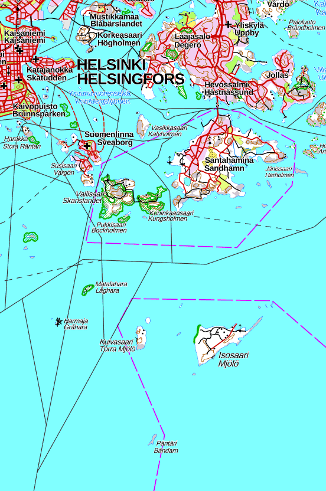
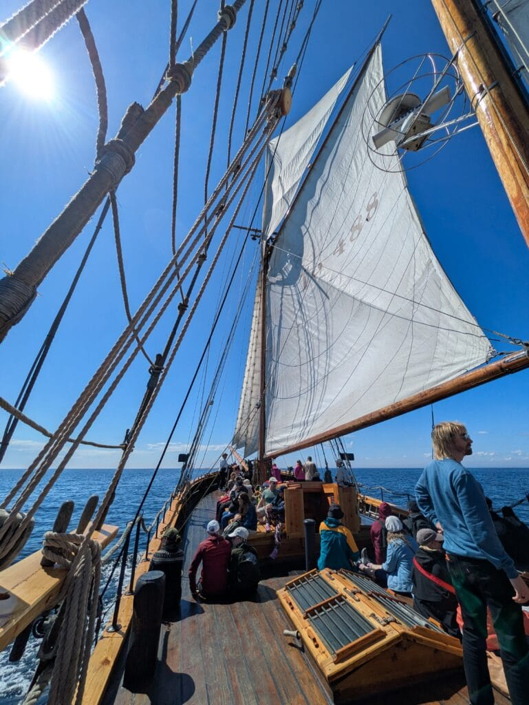

Kesäkuun ensimmäinen sunnuntai tarjosi mukavan kokemuksen. Saimme vaimon kanssa lahjaksi pienen merimatkan Helsingin edustalle ulkomerelle. Vuonna 1947 Porvoon maakunnassa rakennettu [kaljaasi Astrid](https://purjelaiva.fi/maux-astrid) vei meidät lintuja ja hylkeitä etsimään ja katsomaan. Löytyihän niitä.

Helsingin edustan merialuetta, jossa purjehdus tapahtui.

Matka alkoi Helsingin Kruununhaasta Halkolaiturista. Suuntasimme aluksi auringonpaisteessa ja miedossa tuulessa kohti ulkomerta. Reitti kulki Halkolaiturista Santahaminan ja Kuninkaansaaren välistä ulos. Alkumatkan kaunis ilma vaihtui Santahaminan kohdalla merisavuksi, toki aurinko paistoi kirkkaalta taivaalta, mutta muuten näkyvyys oli ehkä 100 metriä. Moottorin avustuksella suunnattiin udussa kohti Isosaarta ja sen itäreunaa ja siellä olevia luotoja. Onneksi merisavua ei kauaa kestänyt. Purjeet nostettiin matkustajien avustuksella ja aloimme matkata Isosaaren eteläpuolta hiljalleen myötätuulen tapaisessa kohti länttä.

Purjeet on nostettu. Osa matkustajista sai osallistua nostoon. Tässä ollaan menossa Isosaaren eteläpuolella kohti länttä.

Lintujakin nähtiin Isosaaren ympäristössä. Ulkomeren linnustosta riskilöitä oli paljon, samoin haahkoja poikueineen, isokoskeloita ja tukkakoskeloita. Merilokkeja, harmaalokkeja, kalatiiroja, lapintiiroja, räyskiä. Kahlaajista rantasipi, karikukko ja punajalkaviklo.

Isosaaren luota purjehdimme etelämmäs Päntärille. Sieltä näimme pikaisesti yhden harmaahylkeen köllöttelemässä lännen suunnassa olevalla luodolla, josta se pian kömpi mereen ja katosi näkyvistä. Hyljesafari oli siis nimensä arvoinen ;) Päntärillä tuntui olevan linnuilla melkoinen hätä, lokit olivat ilmassa kailottaen ja poikaset uimassa avomerellä. Syykin selvisi. Ulkosaareen oli rantautunut moottoriveneellään kaksi miestä aseineen. Olivat laittaneet viisi haahkakuvaa kellumaan länsirannalle ja odottivat ammuttavaa. Valitettavasti haahkan kevätmetsästys on sallittu Helsingin edustan ulkosaaristossa. Suurta haittaa miehet aihettivat kuitenkin pelkällä oleskelulla pienessä saaressa, pesimälinnut olivat hädissään. Mielestäni törppöä käytöstä näiltä miehiltä. Valitettavasti Päntäri ei ole rauhoitettu.

Päntäriltä matka jatkui kohti Harmajaa. Yli lensi pieni 12 yksilön sepelhanhiparvi kohti arktisia alueita ja majakkasaarella oli pieni räystäspääsky-yhdyskunta. Matkalla näkyi myös pari pilkkasiipeä sekä lisää räyskiä. Harmajalta suuntasimme nyt koneiden avustuksella Vallisaaren ja Suomenlinna länsipuolitse kohti Helsinkia ja Halkolaituria.

Kaiken kaikkiaan onnistunut purjehdus. Onneksi otin kaukoputken mukaan kiikarien lisäksi.  
Leppoisa opas Eero Haapanen oli mies paikallaan ja saatiinhan sitä kalakeittoa matkan aikana.

