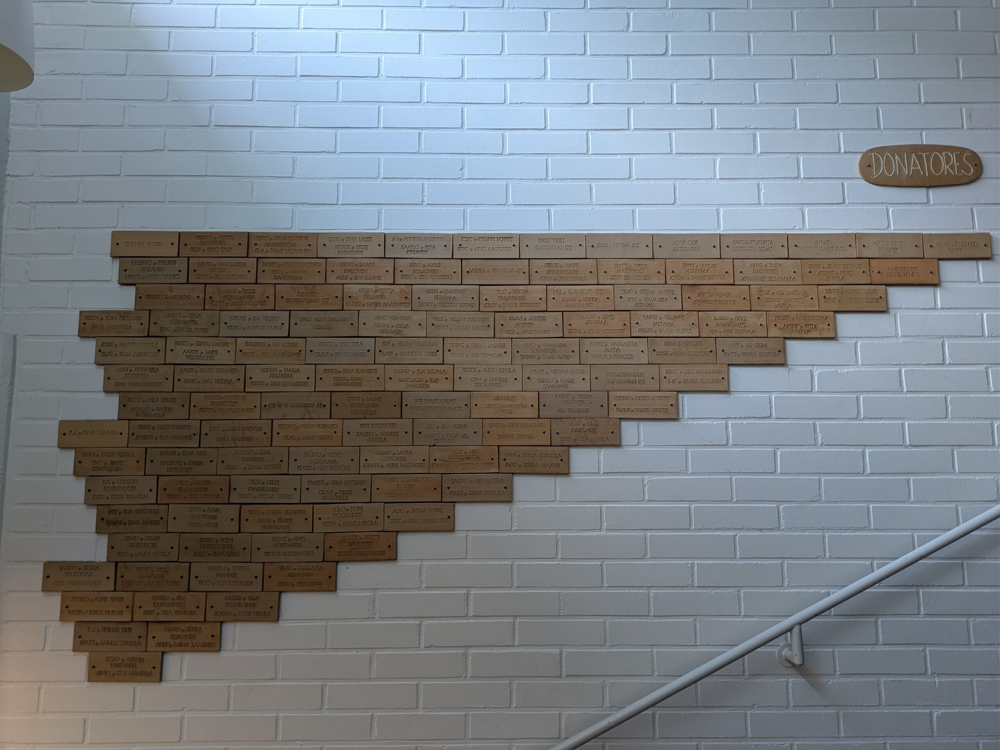

Perjantaina 29.5.2026 kokoonnuimme vajaan kolmenkymmenen luokkakaverin voimin [Herttoniemen yhteiskoululle](https://www.heryk.fi/) viettämään riemuylioppilasjuhlaa. Riemuylioppilaaksi "pääsee", kun varsinaisesta ylioppilasjuhlasta on kulunut 50 vuotta.

Aloitin matkani tapaamiseen Herttoniemen yhteiskoululle kävellen Siilitien metroasemalta Oravatien ja Ilvestien sekä Karhutien kautta. Halusin vaihteeksi taas katsastella mitä lapsuusmaisemissa on tapahtunut. Paljon näyttää olevan ennallaan, onhan tuo omakotialue jo kauan ollut rakennettuna stabiilissa tilassa ja pienet metsä- ja puistoalueet säästyneet lisärakentamisella ainakin toistaiseksi.

Kotitaloni oli aikoinaan Herttoniemen viides talo, pitkälti metsää oli lähtienoot silloin 1940-luvulla.  
Isäni rakensi sen sodan jälkeen Saurion tehtaiden henkilökunnalleen varaamille vuokratonteille. Vanhempani kutsuivat itseään leikkimielisesti Herttoniemen alkuasukkaiksi.  
Kotitalo oli par'aikaa maalattavana, väri pysyy ennallaan ns. lyijynvihreänä tms. Minä olinkin maalannut edellisen kerran taloa, kun vanhempani vielä asuivat siiinä. Rakas paikka, synnyinkoti. Kotitalosta on n. viiden minuutin kävelymatka koululle, helppoa olivat koulumatkani siis.

Herttoniemen yhteiskoulu on yksi monista Helsingin yksityisistä kouluista, jotka tarjoavat kaupungille yläkoulun ja lukion palveluita. N. 40% näistä kouluista Helsingissä ovat yksityiskouluja, tämän tilastotiedon kertoi koulun rehtori meille tapaamisessamme. Koulu on aikoinaan saatu pystyyn Herttoniemeen pitkälti paikallisten asukkaitten ja yritysten lahjoitusten avulla. Omat vanhempanikin olivat aikoinaan kantaneet kortensa kekoon, siitä todisteena nimilaatta Donatores -seinämällä. Ylioppilaaksi kirjoittivat täältä Herykistä myös isoveljeni ja -siskoni.

 

Rehtori Johanna Kallio on itsekin käynyt Herykin ja meidän vuosikertamme oli ensimmäinen lakitus, jonka hän siis ekaluokkalaisena v. 1976 on koulussa nähnyt. Nyt hän sai sitten lakittaa meidät uudestaan, riemuylioppilaiksi. Lauloimme suvivirrenkin rehtorin säestämänä, hän on musiikkitieteen maisteri MuM, joten pianosäestys sujui mallikkaasti. Puhetta pidettiin ja hiljainen hetki myös, sillä ainakin 2 poikaa ja 4 tyttöä on joukostamme poissa. Yhteiskuva otettiin koulun valokuvaajan toimesta. Saimme kiertokäynnin koulun tiloissa, minun mieleeni jäi etenkin musiikkiluokka, jossa oli soittimia joka lähtöön ja myös äänieristetty studion soittohuone.

Olimme kutsuneet myös kaksi vanhaa opettajaamme tapaamiseen, voi kuinka mukavaa olikin tapaaminen heidän kanssaan. Saimme mukaamme myös uuden vuosikertomuksen, johon luokkatoverini Ari Laamanen oli tehnyt muistelukirjoituksen kouluajoista, jossa poimin tähän lauseeen: "Lukiossa oli kivaa, jopa niin kivaa, että kävin 7. luokan kahteen kertaan". Niinhän minäkin kävin.  
Jokainen sai mukaansa myös koulun 100-vuotishistoriikkikirjan Herykin hengessä, painettu versio. ([Herykin hengessä pdf-versio](https://drive.google.com/file/d/18eme3qQGYcHl7uQg875S8EBtSIhl70VL/view?usp=sharing))

Koulukierroksen ja opettajien tapaamisen jälkeen siirryimme paikalliseen ravintolaan syömään ja jutustelemaan. Juttua ja muisteloa riitti ja tapaamme ensi vuonna uudestaan.

Varsinaisena uusien ylioppilaiden päivänä kaksi meistä riemuista oli koululla jakamassa riemuylioppilaiden stipendejä. Yksi tytölle ja yksi pojalle, heidät olivat opettajat valinneet.

[Herttoniemen yhteiskoulun verkkosivut.](https://www.heryk.fi/)

###### Fediversumi -reaktiot
