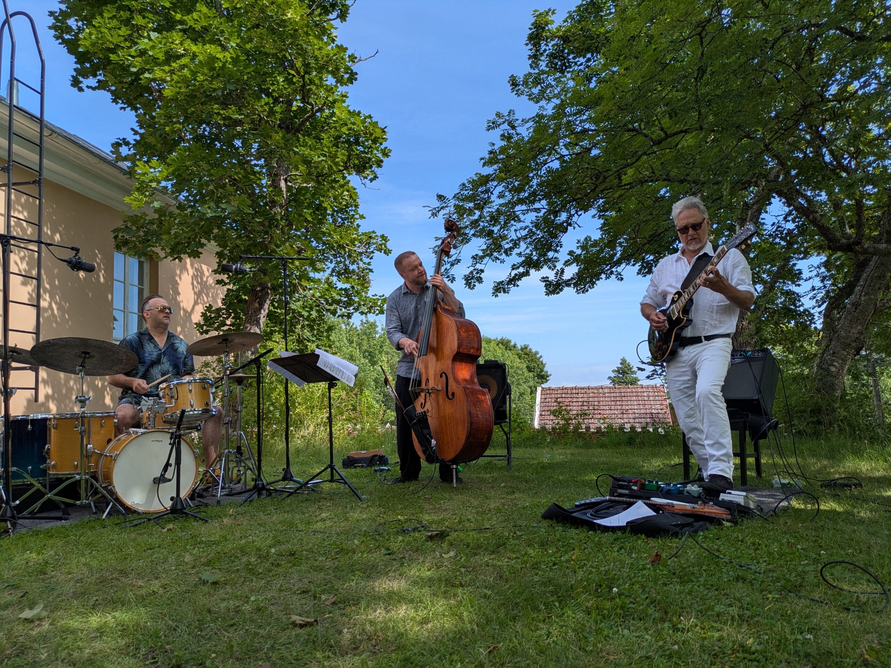
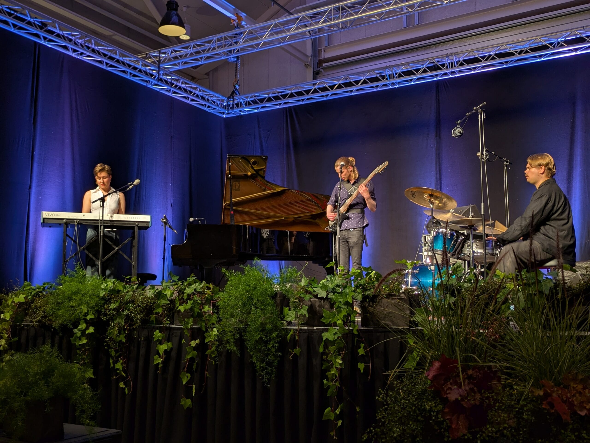
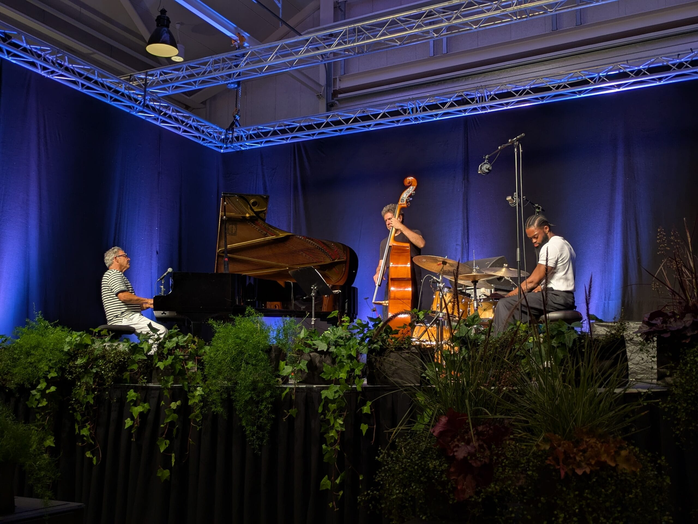

Kuudetta kertaa peräkkäin Turku Sea Jazz -festareilla. Nämä ovat sellaiset pienet festarit, kun vertaa Pori Jazziin. Minulle Porin jazzit ovat menettäneet kiehtovuutensa. Lippujen hinnat ovat Porissa kovat ja jazz tuntuu välillä ajautuneen sivuraiteelle. On tullut viihdyttyä paremmin pienillä tapahtumilla kuten tämä Turku Sea Jazz, Porvoo Jazz Festival ja Helsingissä WeJazzin järjestämät jutut kuten ja Odysseys festivaali.

Meidän osalta Turku Sea Jazz festari alkoi jo keskiviikkona junamatkalla Turkuun ja alkuillan ilmaiskonsertilla kirkon puistossa. Siellä musisoi kitaristi Olli Soikkeli ja NYC Trio.  
**Olli Soikkeli** – kitara  
**Antti Lötjönen** – kontrabasso  
**Teppo Mäkynen** – rummut  
Kuvat kirkkopuistossa jäivät ottamatta.

Kuudes kerta näillä festareilla, mutta neljäs kerta meillä Seilissä. Ensin on siis venematka Seiliin, tällä kertaa meidät vei M/S Lövskär. Seilin konsertit ovat olleet intiimejä tapahtumia. Ensin Seilin pienessä puukirkossa [https://fi.wikipedia.org/wiki/Seilin\_kirkko](https://fi.wikipedia.org/wiki/Seilin_kirkko) ja toinen Seilin sairaalan pihanurmikolla.

Soolona kirkossa ollaan aiempina vuosina kuultu mm. Teemu Viinikaista, Panu Savolaista ja Pauli Lyytistä. Tänä vuonna oli torstaina vuorossa soolona harmonikkataiteilija Harri Kuusijärvi ja hänen elektronisesti laajennettu harmonikkansa. Erinomainen konsertti.

https://loops.video/v/hbtqPaRNNd

Torstaina Seilissä lounaan jälkeen oli vuorossa pihakonsertti. Kitaristi Raoul Björkenheimin trio POLYFREE

 

**Raoul Björkenheim** – kitara  
**Jori Huhtala** – basso  
**Sam Ospovat** – rummut

Festarin pääkonsertit perjantaina ja lauantaina olivat taas takaisin Ruissalon telakalla. Onneksi, sillä se on viihtyisä paikka. Me olimme paikalla vain perjantain keikat.

Ensin mainio Maja Mannila Trio

 

**Maja Mannila** – laulu, piano  
**Johannes Granroth** – basso  
**Mooses Kuloniemi** – rummut

Toisena esiintyjänä Joyey Calderazzo yhtyeineen.

 

**Joey Calderazzo** – piano  
**Orlando Le Fleming** – kontrabasso  
**Donald Edwards** – rummut  

Ihan mukavat oli kelit ja musiikki, ehkä taas ensi vuonna uudestaan.
