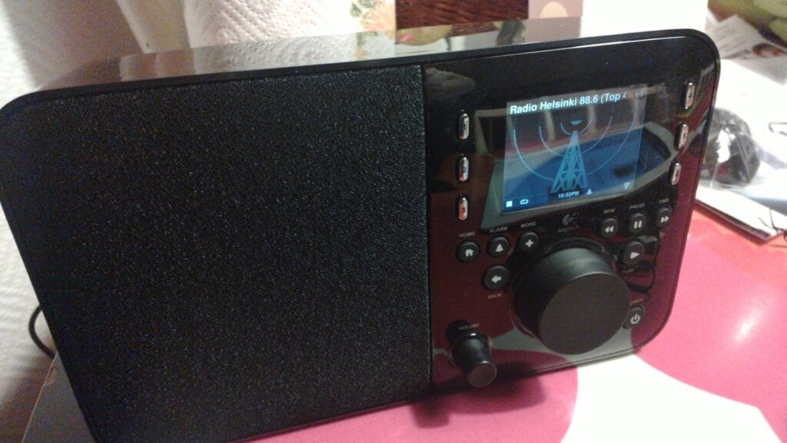
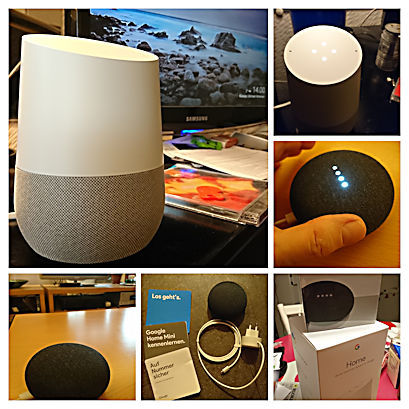
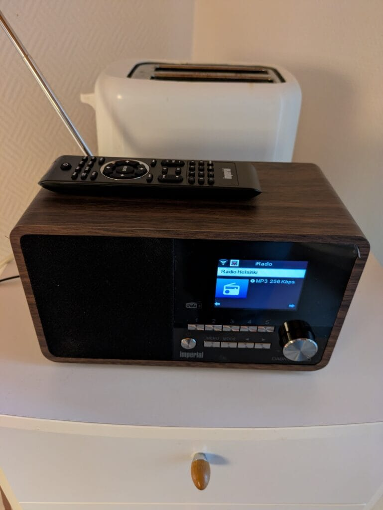

Kyllä aamuhetkeen kuuluu radion kuuntelu. Vuositolkulla olemme aamiaispöydän antimien ääressä kuunnelleet keittiöradiosta Radio Helsinki -kanavaa ja vähän muutakin.

Alunperin minulla oli Logitech Squeezebox Radio. Se oli 2010-luvun alkupuolta.  
Siinä oli Wi-Fi ja TuneIn-palvelu, jonka kautta sain striimattua Radio Helsinki -kanavaa. Mono ääni, mutta ihan kelpo pieneksi laitteeksi.

Tämän ensimmäisen ns. keittiöradion lakattua toimimasta, [hankin itselleni lomamatkalla Berliinistä Google älykaiuttimia](https://teuvovaisanen.fi/2017/11/21/google-home-ja-google-home-mini-toimivat-suomessa/), niitä ei aluksi saanut Suomesta. Siitä alkoi oma älykotikohkaus, joka on onneksi vuosien saatossa laantunut.

Tuo kuvan isompi vaalea purkki on toiminut pitkään keittiöradiona, ääniohjaus on ollut mukava. Radion lisäksi oiva munakelloajastin sekä älyvalojen komentokeskus.

TuneIn-palvelun avulla Radio Helsinki kuuluu. Mono ääni, mutta riittävä taso.

Valitettavasti YLE lopetti radiokanavien striimauksen jokunen vuosi sitten eikä TuneIn-palvelusta niitä enää saanut kuuluville. Areenasta toki kuuluu edelleen.  
Tämän lisäksi nyt viimeisen n. vuoden ajan Google kaiuttimia on vaivannut jonkinlainen bugi, eikä sitä ole saatu korjattua. Striimi saattaa katketa kokonaan ihan miten sattuu. Rasittavaa, ei huvita vähän väliä komentaa kaiutinta toistamaan kanavaa, ja sitten ensin striimin aluksi saa kuunnella pakkomainokset ja striimi sammuu pahimmillaan 10 sekunnin kuluttua.  
Liian paljon puutteita, vaihtoon! Tarvitaan uusi radio!

## Imperial DABMAN i150 - kompakti hybridiradio

Verkkoa hieman selattuani päädyin hankkimaan uuden pienen keittiöradion, jossa on mahdollista kuunnella FM-kanavien lisäksi myös internet-radioita. Tämä Imperial oli kunnon alennuksessa (€ 129,00 178,99) ja päätin hieman sokkona sen hankkia, ainahan on palautusmahdollisuus.

Uusi radio on siitä mainio, että nyt saa taas FM-kanavat kuuluviin internet-radiokanavien lisäksi . Älykaiutin ei sitä osannut suoraan. Toki puhelimen apista sai chromecastattua.

Tässä ei ole chromecastia. Mono ja äänen laatu riittävä.

Eipä tuo paljoa vaatinut asennuksessa, liitos Wi-Fi-verkkoon ja sillä käyttövalmis. Yllättävän hyvin YLEn ja osa kaupallisista kanavista kuului ilman suhinoita, vaikka siinä on vain sellainen vajaan metrin teleskooppiantenni. Radio Helsinki on melko heikko lähetysteholtaan, ei toivoakaan saada FM-puolella kuunneltavaksi. Siispä internet-radion puolelle. Valikossa on "kaikki yleisimmät" valmiiksi listattuna, myös HELSINKI. Mutta hölmöä, kun saksassa toimii Radio Helsinki niminen nettiradio ja se on täällä listattuna suomalaisena kanavana. Pöh. Internet-radiolistauksesta puuttuu oikea Radio Helsinki. Mikähän taho ylläpitää tuota listaa? Pitäisi reklamoida.

Internet-radiokanavan voi tuon valmiin listauksen lisäksi lisätä manuaalisesti. Radio Helsingin striimi on osoitteessa [https://stream.radiohelsinki.fi/stream](https://stream.radiohelsinki.fi/stream) ja lisäsin sen laitteeseen käsin.

Nyt on pikavalinta ykkösessä striimi valmiina, eikun napin painallus ja kahvin keittoon!

