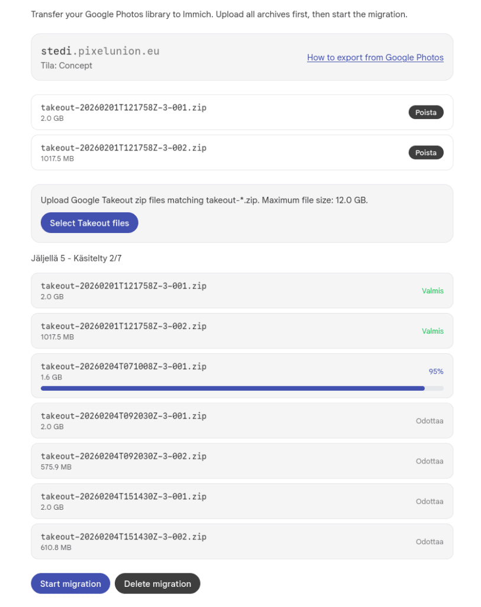
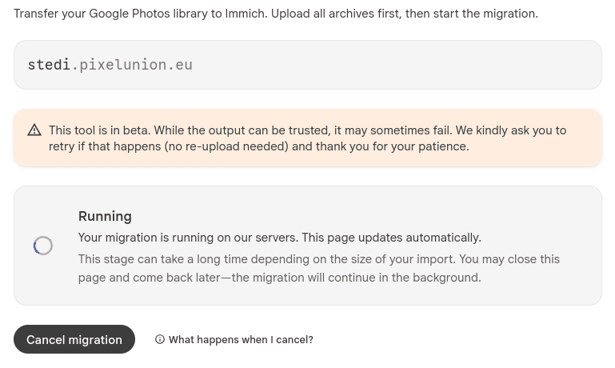
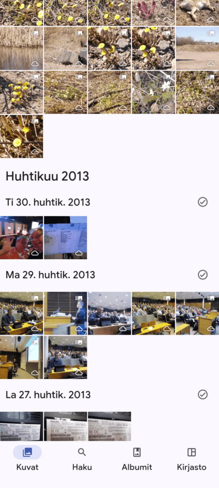
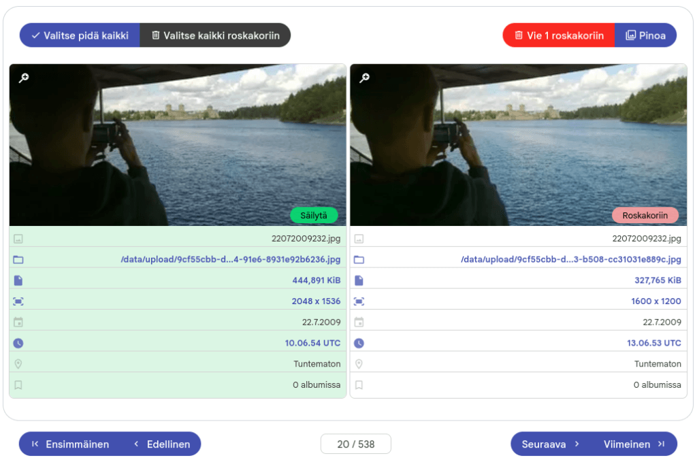

Valokuvien siirto pois Google Kuvat -palvelusta on ollut itselläni jo pitkään suunnitteilla / pohdinnan alaisena. Tämä kaikki syystä, että haluan vähentää riippuvaisuutta etenkin amerikkalaisista ns. Big Tech -yrityksistä. Olin jo ottanut alkuvuodesta 2025 käyttööni eurooppalaisen Nextcloud-palvelun, sehän on eräänlainen vastine Google Drivelle. Nextcloudissa minulla on tiedostot ja siellä on mahdollisuus myös hallinnoida kuvia, tiedostojahan nekin ovat.

Tällä hetkellä minulla siirtyy puhelimen muistista automaattisesti kuvat sekä Google Kuviin, että Nextcloudiin, elän "projektini" hitaassa siirtymävaiheessa. [Tarkoituksenani oli rakentaa itselleni NAS](https://teuvovaisanen.fi/2026/02/04/valokuvien-siirto-pois-google-kuvat-palvelusta/), mutta se suunnitelma on ainakin nyt toistaiseksi jäässä. Olen kuitenkin pikkuhiljaa ladannut Google Takeoutteja itselleni. Apuohjelman avulla olen "liimannut" metatietoja takaisin itse kuviin ja kuvat ovat ulkoisella kovalevyllä, tarkoitus on antaa jälkikasvulle kuvia ilman sotkeutumista pilvipalveluihin.

Nextcloudin kuvapalveluun en ihan ole ollut tyytyväinen, hieman kankeaa on työskentely sen kanssa, toki sen kanssa pärjää. Nextcloudissa käytössäni on **Muistot** sekä **Kuvat** sovellukset. Jonkinlaista tekoälyn avulla prosessoitua palvelua niissäkin on tarjolla, kasvojen tunnistusta ja kuvan aiheeseen sen sisältöön tapahtuvaa luokitusta. Tekoälyn laatu ei ole kummoinen ainakaan kuva-aiheiden tunnistuksessa.

## Pixelunion

Innostuin nyt kokeilemaan [Pixelunion.eu](https://pixelunion.eu) -palvelua luettuani Rollen kirjoittaman artikkelin aiheesta: [https://rolle.design/google-photos-to-pixelunion](https://rolle.design/google-photos-to-pixelunion) . Pixelunion on Google Kuvien kaltainen pilvipalvelu. Pixelunion pohjautuu ymmärtääkseni [Immich -ohjelmistoon](https://immich.app/).

Olen nyt siirrellyt aiemmin lataamiani takeoutteja Pixelunionin tarjoamaan siirtotyökaluun, jolla kuvat ja niiden metatiedot siirretään palveluun. Siirtotyökalu toimii moitteetta, vaikka sen kerrotaan olevan betavaiheessa.

Google Takeout -tiedostot ladataan palveluun.

Takeout -tiedostojen lataamisen jälkeen käynnistetään siirto.

## Pixelunion puhelimessa

Kuvat on nähtävissä tietty selaimella https://pixelunion.eu -palvelussa omassa itse valitussa alidomainosoitteessa. Puhelimeen on saatavilla kaksi appia. Pixeunionin oma sekä Immich. Ne ovat kuin kaksi marjaa, taitaa olla Immichistä tehty vain pieni forkkaus tuohon Pixelunion-appiin. [https://pixelunion.eu/help/immich/mobile-app/](https://pixelunion.eu/help/immich/mobile-app/)

Pixelunion app ja sen käyttöliittymä on hyvin Google Kuvien appin kaltainen

Puhelimen apin avulla saa uudet puhelimella otetut kuvat valumaan pilveen ihan samalla tavalla kuin Androidin omalla Google Kuvat -apilla.

Pixelunionin verkkopalvelussa on kätevä kaksoiskappaleiden tunnistaminen. Olen jo siivonnut parisen tuhatta tuplaa pois kuvakatalogistani.

## Valinta edessä

Siirryn Google Kuvista pois, se on selvä. Nyt jää ratkaistavaksi käytänkö Nextcloudia vai Pixelunionia vain kenties sitten joskus se oma NAS. Nyt hetken käytettyäni Pixelunionia, olen siihen ainakin näin aluksi tyytyväinen.

###### Fediversumi -reaktiot
