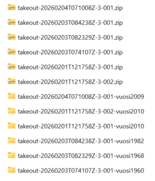
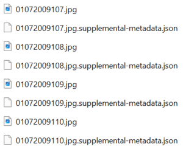
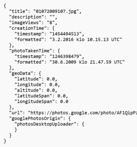
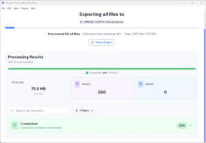
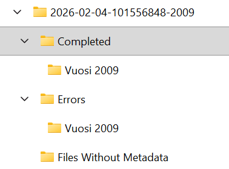
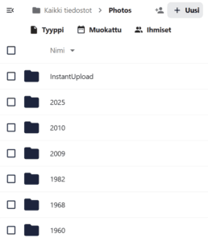

Seuraava vaihe on käynnistynyt siirtymisessäni oman datani parempaan hallintaan.  
Haluan siirtää valokuvakoelmani pois Google Kuvat -palvelusta ja olen tutkinut kuinka se olisi mahdollista. Nyt olen löytänyt hyvän ratkaisun, siitä tässä blogikirjoituksessa on kyse.

TLDR; Yksinkertaistettuna siirto tapahtuu näin

- Pyydetään kuvat Google Takeout -palvelun kautta

- Jos pelkät kuvat riittävät, Takeout-palvelusta saa ne ZIP-pakattuina tiedostoina

- Jos haluaa metatiedot kuten kuvauspäivämäärät ja paikkatiedot mukaan, on tehtävä lisätemppuja, niistä tarkemmin edempänä kirjoituksessani

- Siirretään ladatut kuvat talteen, mihin sitten itse kukin haluaakaan ne tallentaa

## Taustaa

Omien valokuvieni ottaminen ja ja niiden säilytys digitalisoitui itselläni 2000-luvun alkupuolella, pitkälti kamerapuhelimien yleistyttyä ja digikameroiden hintojen laskettua. Pikkuhiljaa fyysiset paperivalokuvat vähenivät ja valokuvat "piiloutuivat" muistikorteille, kovalevyille, CD-levyille, disketeille, USB-tikuille jne. Aluksi se tuntui "hienolta", kun valokuvia pystyi katselemaan diashow-tyyppisesti. Melko pian tajusin, ettei niitä kuvia ollut enää niin helppo katsella, kun ne olivat hujan hajan eri medioilla. Samalla katosi se fyysinen valokuva-albumin ja paperikuvan hypistelyn tunne kuvien katselusta.

Sitten tuli onneksi avuksi pilvipalvelut, jonne kuvat sai "varmuuskopioitua" talteen hujan hajan olevista tallennuspaikoista. Kirjoittelinkin aiheesta kymmenisen vuotta sitten [https://teuvovaisanen.fi/2016/02/12/kuvat-talteen-pilvipalveluun-google-kuvat/](https://teuvovaisanen.fi/2016/02/12/kuvat-talteen-pilvipalveluun-google-kuvat/). Aika monta aiheen kurssiakin kerkesin työelämän aikana tästä kuvien talteen laittamisesta pitää.

No niin ja sitten pikakelauksella eteenpäin. Olen nyt kymmenisen vuotta tuon jälkeen sitten siirtämässä kuvia pois tuolta Googlen pilvestä. Miksi? Syitä on muutamia, listaanpa niitä tähän.

- haluan kuvat omaan haltuun ja kun olen nörtti ajattelin laittaa NAS-palvelimen itselleni sen lisäksi että ne ovat Nextcloudissa

- haluan kokeilla Immich -kuvaohjelmaa omassa NASsissa, ehkä myös Photoprism tulee kokeiltua

- kun kuvat ovat omassa hallussani NASsilla ja ulkoisilla kovalevyillä, saa jälkikasvuni ne helpommin perinnöksi kuin pilvipalveluista - sillä "memento mori", niin se vain on

- olen myös poliittisista syistä siirtymässä pois digijättien palveluista, näistäkin kirjoittelin aiemmin  
    [https://teuvovaisanen.fi/2025/02/19/siirtyminen-digijattien-palveluista-parempaan-yksityisyyteen/](https://teuvovaisanen.fi/2025/02/19/siirtyminen-digijattien-palveluista-parempaan-yksityisyyteen/)  
    ja  
    [https://teuvovaisanen.fi/2025/02/20/siirtyminen-googlen-pilvesta-nextcloudiin/](https://teuvovaisanen.fi/2025/02/20/siirtyminen-googlen-pilvesta-nextcloudiin/)

- onpahan yksi pieni summa rahaa poissa menoista, kun jatkossa ei tarvitse maksaa Googlelle tallennustilasta

## Kuvien lataus Google Kuvista

Tämä on yksinkertainen prosessi.

- Selaimella [https://takeout.google.com](https://takeout.google.com) -palveluun ja siellä poistetaan tuotevalintaruksit kaikista tuotteista ja sen jälkeen valitaan vain Google Kuvat

- Sen jälkeen valitaan ne kuvat, jotka halutaan ladattaviksi. Itse olen vuosi kerrallaan tehnyt pyynnön ja hyväksynyt oletusasetukset. Jos kuvia on paljon, pilkotaan ne max. 2 Gt zip-tiedostoiksi

- Google lähettää sitten sähköpostin, kun zip(it) on valmiina ladattavaksi omalle koneelle

- Puretaan zip ja kuvat ovat nyt omalla koneella

Kirjoittelen tässä tätä artikkelia samalla kun työstän kuvien latausta. Alla tietoja siitä, mitä Takeout tarjoaa.

Zip-tiedostoja ladattuna Google Takeout -palvelusta. Olen purkanut ne ja lisännyt itse purkukansion nimeen tiedon vuodesta, jotta pysyisin jyvällä niiden sisällöstä. Vuodelta 2010 oli kuvia enempi, joten se pilkkontui kahdeksi zipiksi.

Ladatuissa kuvissa on joitain Exif-tietoja mukana, mutta osa tiedoista on paketoitu erilliseen JSON-formaatin tiedostoon.

Kuvien rinnalla on kuvaan liittyvä JSON-formaatin tekstitiedosto

JSON-tiedoston sisältä löytyy mm. kuvan ottamisen aikaleima sekä koordinaatit paikasta

Kaikille ei merkitse tietojen puuttuminen kuvista, pelkät kuvat riittävät. Mutta minä haluan kaiken datan. Siis miten ne saa takaisin kuviin?

## Metatietojen liittäminen uudelleen kuviin

On mukava nähdä kuvista se, milloin se on otettu ja missä. Someen jaetuista kuvista ne yleensä riisutaan jakovaiheessa pois esim. puhelimissa, mutta omissa yksityisissä albumeissa ainakin minä haluan nuo tiedot. On kiva nähdä kartalta, mitä kuvia siinä kohtaa on otettu, monikin kuvaohjelma osaa tuon tiedon näyttää. Google Kuvissa tuo toiminto toki on, mutta kun siirrän kuvat Nextcloudiin, on sijaintitieto ympättävä uudestaan kuviin, jotta ne näkyisivat esim. Muistot-ohjelmassa Nextcloudissa.

Kokeilin aluksi Linuxilla Github-palvelusta muutamaa apuohjelmaa / skriptiä, jolla tämä takaisinliitos tehtäisiin. En saanut niistä mitään toimimaan, taisi olla ylläpito skripteillä jäänyt vaiheeseen. Vaihdoin Linux-koneesta Windowsiin ja löysin ensin Windows Storesta ohjelman **TakeoutFixer**, joka osasi liittää jotain tietoja kuviin tuosta JSONista, valitettavasti ei paikkatietoja kuitenkaan.  
Etsiskelin Qwant-hakukoneella tietoa asiasta ja löysin ohjelman, josta oli kokeiluversio saatavilla Macille. Linuxille ja Windowsille. [https://metadatafixer.com/](https://metadatafixer.com/)  
Nyt kun olin wintoosassa, latasin siihen tuon kokeiluversion. Toimi! Ostin siitä samantien maksullisen 39 dollarin version tähän Windows 11-koneeseeni. Olenhan sekakäyttäjä ;)

Metadata Fixer työssään. Ohjelma on todella helppokäyttöinen.

Fixerin tehtyä työnsä on se luonut kansiot, joihin on sijoitettu prosessoidut kuvatiedostot.

Tämän jälkeen kuvat ovat itsellisiä, eivätkä nuo .json -tiedostot enää ole tarpeen. Voi ne toki säilyttää, jos haluaa niitä uudelleen prosessoida jostain syystä.

Olen tämän prosessin jälkeen nimennyt tuon Vuosi 2009 kansion pelkästään 2009:ksi ja sitten siirtänyt koko prosessoidun kansion Nextcloudiin. Tuo NAS on minulla vasta suunnitteilla.

Muutama Takeoutilla ladattu ja Fixerillä ja metatiedoilla prosessoitu kuvakansio on jo Nextcloudissa

Tästä on hyvä jatkaa :)

###### Fediverse -reaktiot
